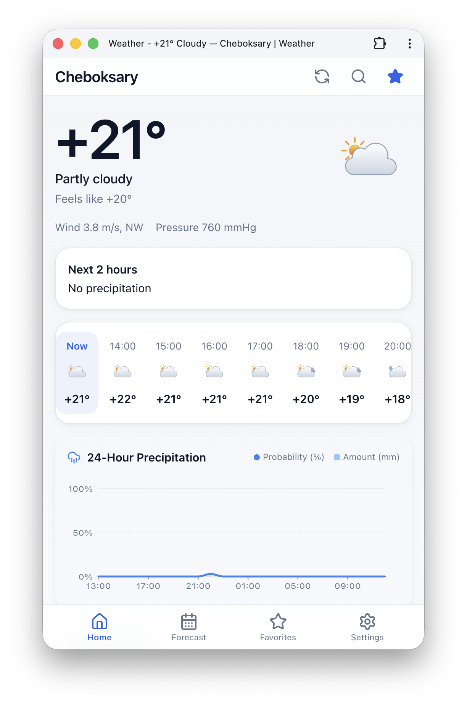
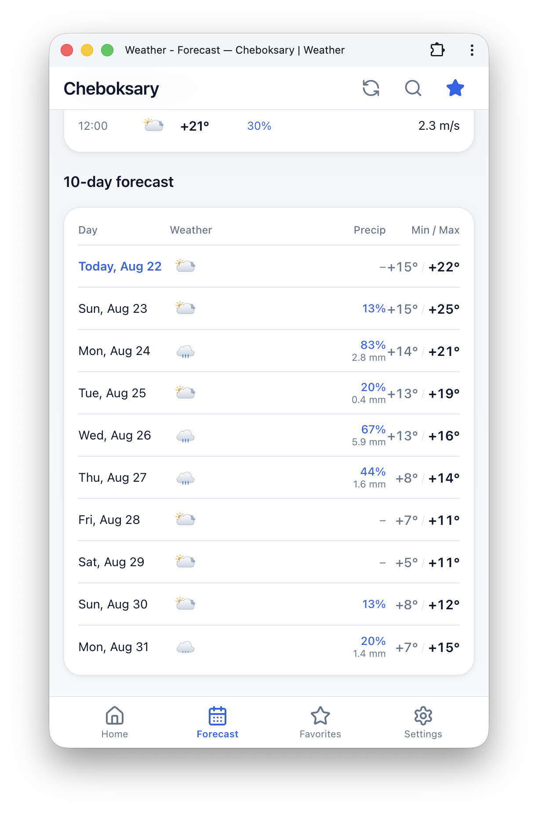
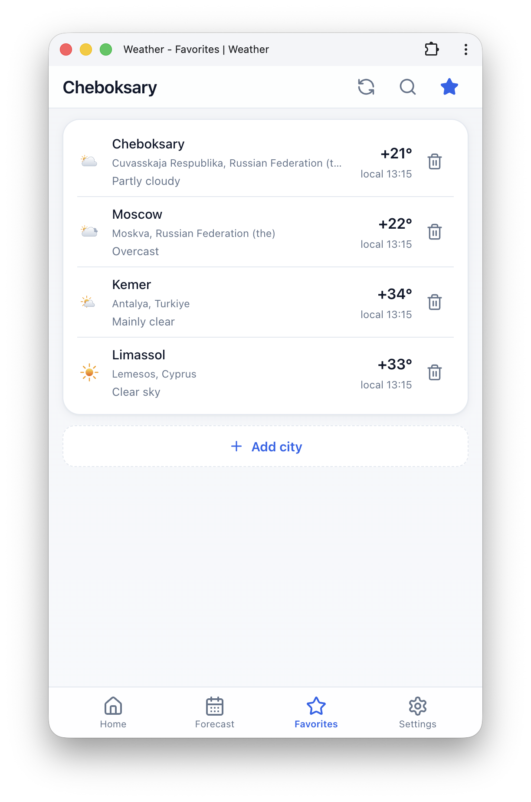
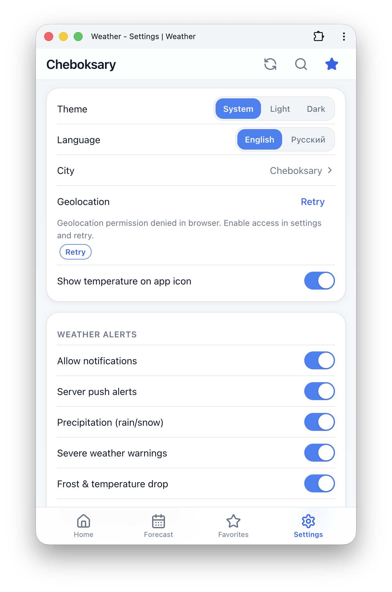

# Gradus

<p align="center">
  <strong>English</strong> &nbsp;|&nbsp; <a href="README.ru.md"><strong>Русский</strong></a>
</p>

<p align="center">
  <a href="https://github.com/zeklop/weather/actions/workflows/deploy.yml"></a>
  <a href="LICENSE"></a>
  <a href="https://www.pwabuilder.com/"></a>
</p>

---

**[Try it live → https://gradus.website](https://gradus.website/)**

A lightweight, high-performance, offline-capable Progressive Web Application (PWA) for weather forecasts inspired by the clean visual density and information hierarchy of modern weather apps. Built with **SvelteKit** (Svelte 5 runes), the open **Open-Meteo API**, and vector **Meteocons**.

| Home | Forecast | Favorites | Settings |
| --- | --- | --- | --- |
|  |  |  |  |

Engineered as a cross-platform Progressive Web Application (PWA). It provides an excellent standalone experience on **iOS Safari**, **Android (Chrome)**, and **Desktop environments (Mac, Windows)** via Chrome, where it can be installed as a native-like app. It is completely static (zero server-side runtime footprint), with resilient offline caching, and deployable to **GitHub Pages** or any static web server.

---

## Features

- **Home Screen Hero:** Large temperature display in °C with Unicode minus (`−`), weather conditions, feels-like temperature, wind speed in m/s with 8-point compass direction, and atmospheric pressure in mmHg.
- **Interactive Hour Scrubber:** Select any hour on the hourly rail to temporarily preview conditions in the hero block with an instant `✕ Now` reset button.
- **Native Mobile Pull-to-Refresh:** Smooth gesture with resistance, haptic feedback (`vibrate`), and animated status pill to refresh forecasts on the fly.
- **Astronomy (Sun & Moon):** Dynamic SVG sun arc with sunset/sunrise countdown and polar day/night handling, plus Moon Phase with illumination % and days to next full/new moon (hemisphere-aware).
- **Detailed Air Quality & Pollen:** European AQI score, individual pollutant gauges (PM2.5, PM10, NO₂, SO₂, O₃, CO) with WHO 24h targets, and 6 pollen species under a collapsible accordion.
- **Coastal Water Temperature:** Sea surface temperature and wave height for coastal cities (Open-Meteo Marine API with negative caching for inland locations).
- **Home Screen Layout Customization:** Rearrange sections using up/down controls or toggle visibility in Settings.
- **Expanded Weather Metrics:** UV index, humidity, dew point, and air quality index in a dedicated details card.
- **Near-Term Precipitation Heuristic:** Deterministic 2-hour rain/snow probability heuristic based on hourly data with direct map link, plus an interactive 24-hour precipitation SVG chart.
- **Hourly Forecast Rail:** Smooth horizontal scrolling forecast («Now» + 24+ hours) with current-hour highlighting, day/night weather icons, and precipitation probability badges.
- **10-Day Forecast:** Daily summary on Home and detailed breakdown on the `/forecast/` page.
- **City Search & Geocoding:** Powered by Open-Meteo Geocoding API (300 ms debounce, queries starting at 2 characters, up to 8 results with region/country, automatic request cancellation, localized queries).
- **Favorites:** Fast local storage of favourite locations (`localStorage`), quick switching, and cached temperature previews on `/favorites/`.
- **Settings:** City selection, GPS geolocation request, last updated status, theme (System / Light / Dark), language switcher (English / Russian), section customizer, weather alerts configuration, server push alerts toggle, and iOS installation guidance.
- **Bilingual Interface (i18n):** English by default with instant Russian switch; localized WMO descriptions, units, compass points, and date/time formatting.
- **Smart Weather Alerts & Background Web Push:** In-app alerts when the tab is active, plus autonomous background Web Push delivery via lightweight Cloudflare Workers + D1 for locked/closed devices (iOS 16.4+ standalone / Android / Desktop) with quiet hours, rate limiting, and 3-hour cooldown.
- **Privacy-First Analytics Dashboard (`/stats/`):** 100% anonymous telemetry with token-protected management — device platform and language breakdowns, active installations over 7 days, a 30-day activity chart (app opens vs dispatched alerts), a push onboarding funnel (installs → opt-ins → live subscriptions), alert type breakdown, subscription health metrics (stale / auto-removed / never-alerted), top subscriber cities, and alert history. The admin token persists in `localStorage` until explicitly locked.
- **Dynamic Favicon & App Badging:** Live temperature rendered in the browser tab favicon (Canvas API) and Home Screen icon badge via `navigator.setAppBadge` (iOS 16.4+ standalone / Android).
- **Platform-Specific PWA Prompts & Onboarding:** Native 1-click install banner on Android (`beforeinstallprompt`), top banner with animated step-by-step instructions for iOS Safari, and smart push alert onboarding banner on first standalone launch.
- **Interactive Radar Map:** MapLibre GL JS map on `/map/` with RainViewer precipitation radar animation (past + forecast frames) and layer switching. For cities in Russia and Belarus, the map link is automatically omitted because the provider (RainViewer / MeteoLab) unilaterally stopped collecting and serving radar data for these regions.
- **Offline Mode & Caching:** Two-layer cache (in-memory `Map` + versioned `localStorage` with LRU eviction, 8-city cap, and 1 MB budget), SWR strategy (fresh < 15 min, stale < 6 hours, offline fallback with timestamp).
- **Vector Icons:** High-quality SVG Meteocons with dynamic day/night switching based on wall-time solar calculations (sunrise/sunset).

---

## Tech Stack

- **Framework:** [SvelteKit](https://kit.svelte.dev/) 2 with Svelte 5 runes (`$state`, `$derived`, `$effect.root`)
- **Language:** TypeScript (strict mode)
- **Bundler & PWA:** [Vite](https://vitejs.dev/) + [@vite-pwa/sveltekit](https://vite-pwa-org.netlify.app/) (Workbox Service Worker, offline fallback)
- **Adapter:** `@sveltejs/adapter-static` (full static prerender of all routes with `trailingSlash: 'always'`)
- **Styling:** Handcrafted CSS with CSS variables, iOS Safe Areas (`env(safe-area-inset-*)`), and zero UI bloat (no Tailwind / bulky component libraries)
- **Weather Data, Geocoding & Air Quality:** [Open-Meteo API](https://open-meteo.com/) (no API keys required)
- **Radar Data:** [RainViewer](https://www.rainviewer.com/) public radar API (the provider unilaterally blocked radar aggregation and maps for Russia and Belarus; the app automatically suppresses map links for unsupported regions)
- **Maps:** [MapLibre GL JS](https://maplibre.org/) with OpenStreetMap / CARTO basemap tiles
- **Weather Icons:** [Meteocons](https://meteocons.com/) (SVG, MIT License)
- **App Icons:** Original vector SVG + automated PNG generation via `sharp`

---

## Local Development

### Requirements
- Node.js 22+ (see `.nvmrc`)
- npm 10+

### Start Dev Server

```bash
# Install dependencies
npm install

# Start Vite dev server
npm run dev

# Or start with automatic browser launch
npm run dev -- --open
```

---

## Quality Assurance & Building

```bash
# Typecheck TypeScript and Svelte diagnostics
npm run check

# Run Vitest test suites (37 suites, 360+ tests)
npm test

# Verify PWA icon dimensions and maskable safe-zone invariant (radius <= 0.4 * size)
npm run check:icons

# Regenerate PNG icons from SVG source (static/icons/app/icon-source.svg)
npm run icons

# Build static production bundle (outputs to build/)
npm run build
```

---

## Deployment

### 1. GitHub Pages (Primary)

Live applications: **`https://gradus.website/`** and **`https://zeklop.github.io/weather/`**

Both deployments are updated automatically on every push to `main`: one workflow builds two variants (root for the custom domain, `/weather` subpath for GitHub Pages) and deploys each to its target.

To build for a repository subpath deployment:

```bash
PUBLIC_BASE_PATH=/weather npm run build
```

Automated CI/CD is configured in [`.github/workflows/deploy.yml`](.github/workflows/deploy.yml). It runs on pushes to `main` or manual trigger (`workflow_dispatch`), validates checks and tests, generates static assets, and deploys to GitHub Pages.

Repository configuration: `Settings → Pages → Build and deployment → Source: GitHub Actions`.

### 2. Custom Domain / Root Mode (`PUBLIC_BASE_PATH=''`)

When serving from the root of a domain (e.g. `https://weather.example.com/`):

```bash
PUBLIC_BASE_PATH='' npm run build
# or simply:
npm run build
```

### 3. VPS / Static Web Server (Caddy)

Since the app is 100% static, no Node.js runtime is required on the server. A production-ready [`Caddyfile`](Caddyfile) is included in the repository.

### 4. Optional Serverless Push & Analytics Backend (Cloudflare Workers + D1)

For autonomous background push delivery on locked devices and self-hosted analytics:

```bash
cd serverless
npx wrangler login
# Create D1 database, then paste the printed database_id into wrangler.toml
npx wrangler d1 create weather_pwa
# Execute schema migrations (on the remote database, not local)
npx wrangler d1 execute weather_pwa --remote --file=schema.sql
# Generate VAPID keypair (raw base64url format is supported as-is)
npx web-push generate-vapid-keys
# Paste the public key into wrangler.toml (PUBLIC_VAPID_KEY) and set secrets:
npx wrangler secret put VAPID_PRIVATE_KEY
npx wrangler secret put ADMIN_TOKEN   # protects the /stats/ dashboard
# Deploy worker
npx wrangler deploy
```

Also set `APP_ORIGIN` in `wrangler.toml` to the frontend origin (e.g. `https://<user>.github.io`) so CORS only allows the app, and keep `APP_BASE_PATH` in sync with `PUBLIC_BASE_PATH` (`/weather` on GitHub Pages, `""` for root deploys).

Then build the frontend with `PUBLIC_PUSH_WORKER_URL` and `PUBLIC_VAPID_KEY` environment variables. If these variables are omitted, the application runs in 100% static zero-backend mode with graceful fallback.

---

## Installing PWA on iOS (Safari)

1. Open **`https://gradus.website/`** in Safari on iPhone.
2. Tap the **Share** button (box with an upward arrow in the bottom toolbar).
3. Scroll down and select **«Add to Home Screen»**.
4. Tap **«Add»** in the top right corner.
5. Launch the app from your Home Screen — the icon is named **«Gradus»** — for a native standalone fullscreen experience with offline support. On iOS 16.4+ the icon also shows a live temperature badge (enable in Settings).

---

## Installing PWA on Android (Chrome)

1. Open **`https://gradus.website/`** in Chrome on Android.
2. Tap the menu button (**⋮**) and choose **“Add to Home screen”** / **“Install app”** — or tap the install banner that appears at the top of the app.
3. Confirm the installation.
4. Launch the app from your Home Screen — the icon is named **«Gradus»** — for a native standalone fullscreen experience with offline support and a live temperature badge on the icon (badge rendering also depends on your launcher).

---

## Installing PWA on Desktop (Mac / Windows via Chrome)

1. Open **`https://gradus.website/`** in Google Chrome on your Mac or Windows PC.
2. In the right side of the address bar, click the install icon (looks like a screen with a down arrow) or select **"Install Gradus..."** from the Chrome menu.
3. Confirm the installation in the dialog box.
4. The application will be added to your system (Launchpad on Mac, or Start Menu on Windows) and run in its own dedicated window without browser UI.

---

## Attribution & Licenses

- **Weather data, geocoding & air quality:** [Open-Meteo](https://open-meteo.com/) — [CC BY 4.0](https://creativecommons.org/licenses/by/4.0/).
- **Weather icons:** [Meteocons](https://github.com/basmilius/meteocons) by Bas Milius — MIT License.
- **Interactive maps:** [MapLibre GL JS](https://maplibre.org/) — BSD 3-Clause; basemap tiles © [OpenStreetMap](https://www.openstreetmap.org/copyright) contributors and [CARTO](https://carto.com/).
- **Radar precipitation data:** [RainViewer](https://www.rainviewer.com/) (unilaterally blocked Doppler radar feeds and precipitation maps for Russia and Belarus).
- **Reverse geocoding (GPS → city name):** [BigDataCloud](https://www.bigdatacloud.com/) free client-side API.

Detailed license information is available in [THIRD_PARTY_NOTICES.md](THIRD_PARTY_NOTICES.md).
